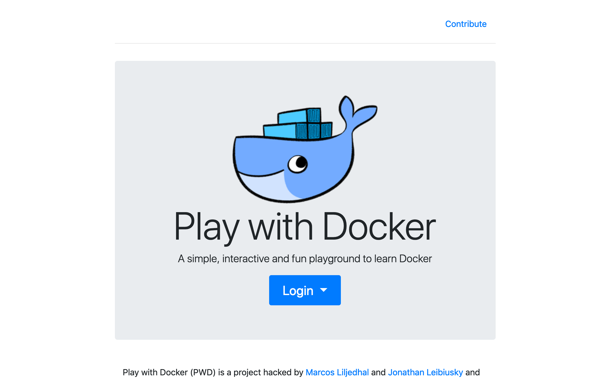
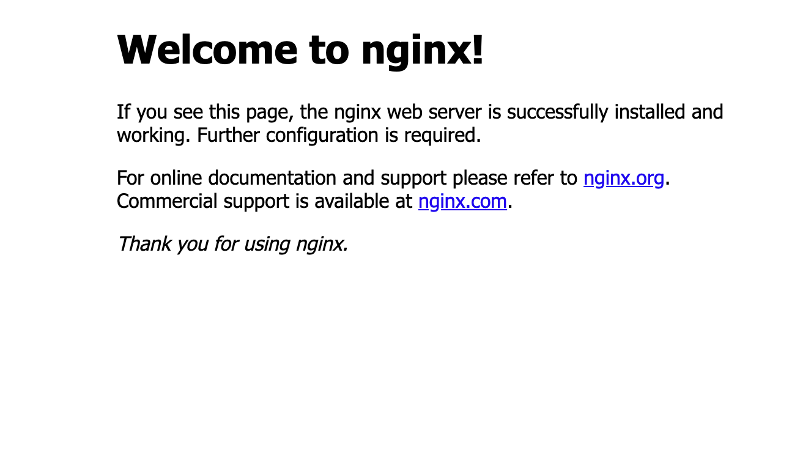

まずはDockerを試してみましょう！  
この章ではDockerコマンドを使用してnginxサーバーを構築することを目標とします。

## 1. Play With Dockerへログイン
当資料ではDockerの環境として[Play with Docker](https://labs.play-with-docker.com/) を使用します。  
ローカルPC (Mac/Windows/Linux) でもDocker動かすことが可能ですがMac/WindowsとLinuxで挙動が一部異なるので、ハンズオンでは挙動を統一することが目的です。



Play With DockerではDockerHubのアカウントが必要になるため、まだアカウントを作成していない方は作成をしてください。

[https://hub.docker.com](https://hub.docker.com)

## 2. インスタンスの起動
ログインすると以下のような画面が表示されるので、まずはインスタンスを起動します。  
サイドバーの `+ ADD NEW INSTANCE` を押して起動を行ってください。


## 3. nginxの起動
まずは単純にnginxを起動してみます。  
以下のコマンドを起動ターミナルで実行してみます。

```
$ docker run -P nginx
```

後の章でdockerコマンドについて解説をしますが簡単にこのコマンドの説明すると、  
「nginxを起動( `docker run nginx` )し、設定されているポートを公開( `-P` )。」という意味になります。

Play With Dockerではポートを開放するとWebブラウザでアクセスできるようになります。  
以下の画像のようにIPの横に `32768` と表示されていれば起動成功です！


## 4. 起動したnginxへアクセス
試しに起動したnginxサーバーへアクセスしてみましょう。  
`32768` をクリックすると以下のようにnginxの画面が表示されるはずです。



## 5. Dockerの停止
Play With Dockerの画面に戻って `Ctrl` + `c` でDockerを停止させましょう。
