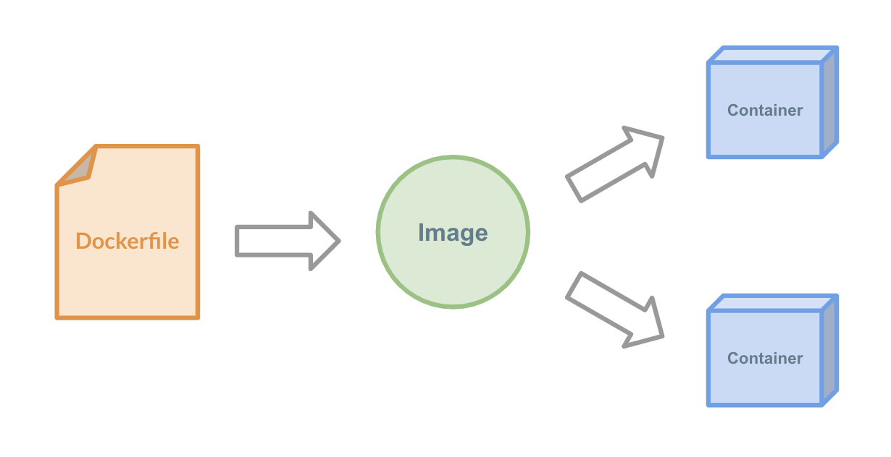
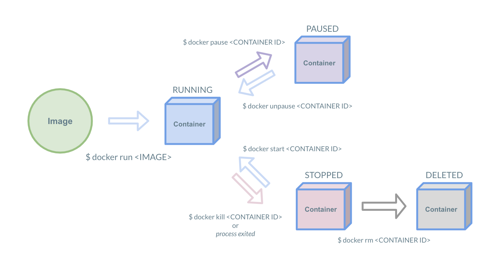
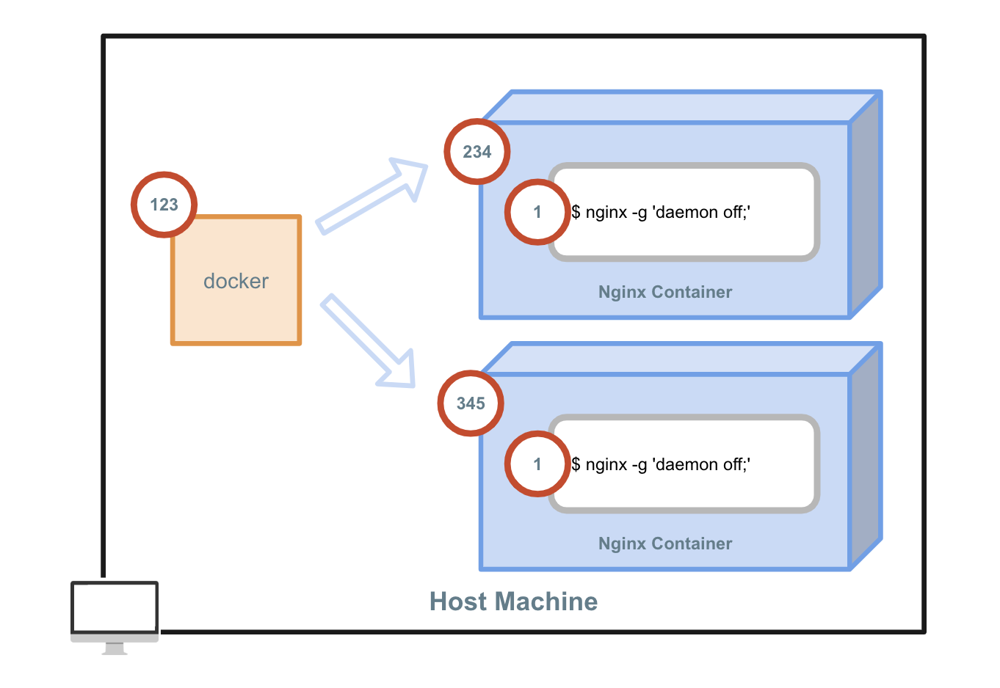

## Docker Containerとは

Docker Image がスナップショットだとしたらDocker Container はその **「スナップショットから起動したプロセス」** です。  
より具体的にいうと `docker run` を実行するとDocker Image をもとにしてDocker Containerが作成され、隔離された環境が作成されます。  
Docker Container は Docker Imageを元にして作成され、リソースの許す限り立ち上げることができます。

## ライフサイクル


Docker Container は大きく5つの状態を遷移します。  

1. `Image`
    - 指定したDocker Image からDocker Containerを起動します。
2. `RUNNING`
    - Docker Containerが起動した状態です。
    - Dockerfileの `CMD` もしくは `ENTRYPOINT` で指定したコマンドがフォアグラウンドで動いている間がRUNNINGの状態です。
    - 例えば `docker run -P nginx` のようにnginxを起動した場合、nginxが起動してアクセスを待ち受けてる間はRUNNINGの状態となります
3. `STOPPED`
    - 起動したContainerが終了した状態です。
    - 正常終了・異常終了、どのような形であっても終了したContainerはSTOPPEDへ遷移します。
4. `PAUSED`
    - Containerが停止した状態です。
    - ユーザーが `docker pause <CONTAINER ID>` を実行すると、現在の状態を保持して一時停止します。
    - `docker unpause <CONTAINER ID>` で一時停止したコンテナIDを指定することで再開することが可能です。
    - ユーザーが明示的に指定しない限りこの状態へは遷移しません。
5. `DELETED`
    - Docker Container は明示的に削除を行わない限り停止した状態で残り続けます。
    - `docker rm <CONTAINER ID>` で明示的に削除するとDELETEDの状態へ遷移し、削除されます。

## プロセスの隔離


コンテナ内のプロセスはホストマシンや他のコンテナと隔離されて実行されます。  
上記の図のようにホストマシンのDockerで作成されたコンテナは新しい環境を作成し、 `CMD` (もしくは `ENTRYPOINT` )で定義されたプロセスは `PID 1` になります。

ためしに `ps` コマンドを実行するDockerを起動し、PIDがいくつになるか確認してみましょう。

```
$ docker run ubuntu ps
  PID TTY          TIME CMD
      1 ?        00:00:00 ps
```
