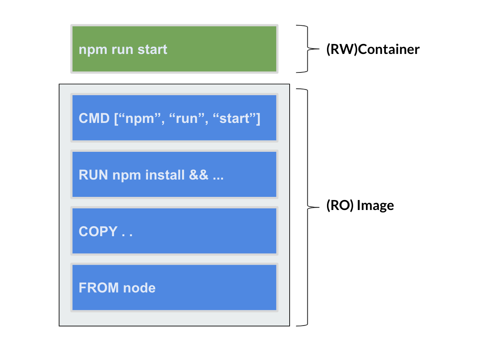
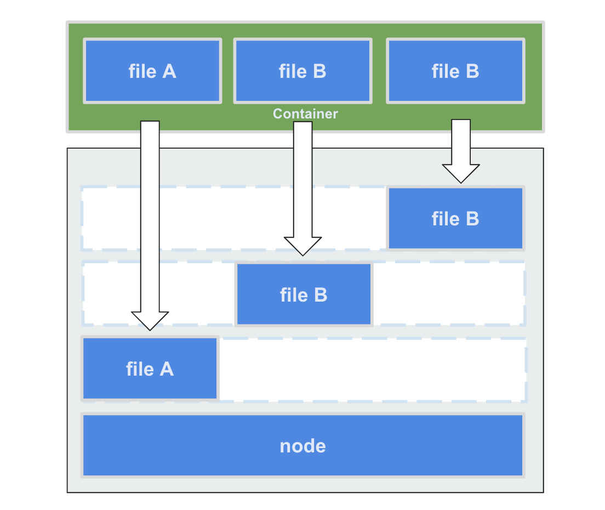

まずはDocker Image のおさらいです。  
Docker Image はDockerfileによって作成される特定の環境のスナップショットです。  
そしてそのDocker Image を実行することでDocker Container を起動することができることがわかりました。

ここで少し深掘りしてDocker Image/Containerの仕組みについて学びましょう。  

## Docker Image のレイヤー
Docker Image は復数のDocker Image の積み重ねでできています。  
例えば以下のようなDockerfileをビルドした際、どのようなレイヤーが作成されるか見てみましょう。

単純なNode.jsのプロジェクト
```dockerfile
FROM node

WORKDIR /scripts

COPY . .

RUN npm install \
  && groupadd app \
  && useradd -g app app \
  && chown -R app:app /scripts

USER app

CMD ["npm", "run", "start"]
```

`web` というイメージ名でビルド
```
$ docker build -t web .
```

`web` が生成したレイヤーを `docker history` コマンドで確認。
```
$ docker history web
IMAGE               CREATED             CREATED BY                                      SIZE                COMMENT
54fd20069376        6 seconds ago       /bin/sh -c #(nop)  CMD ["npm" "run" "start"]    0B
c2f804414f95        6 seconds ago       /bin/sh -c #(nop)  USER app                     0B
319c0e7ebd3c        6 seconds ago       /bin/sh -c npm install   && groupadd app   &…   330kB
710e080b2b76        10 seconds ago      /bin/sh -c #(nop) COPY dir:8e995b34ceaf96897…   372B
aa8685e6ff7d        10 seconds ago      /bin/sh -c #(nop) WORKDIR /scripts              0B
 :
```

## Container


前提として、生成されたDockerImageはRead Onlyです。 
Docker Containerを作成することで変更可能なレイヤーが新しく作成され、その上でプロセスを動かします。  

コンテナ起動後、どのファイルが変更されたかは `docker diff` を使用して確認することができます。  
`docker diff` は非常に有用で、Dockerfile記述時のデバッグによく使用します。

```
$ docker run --name hoge ubuntu touch /tmp/hoge.txt
$ docker container diff hoge
C /tmp
A /tmp/hoge.txt
```

## Unison FileSystem


最後に、Dockerのファイルシステムについです。  
Docker Container から Docker Image へファイルを読み込む際、気をつけないとオーバーヘッドが大きくなります。  
Containerレイヤーに操作対象のパスが存在しない場合、Imageレイヤーにファイルが無いかの捜査を行います。  
この捜査は1レイヤーごとに見ていくため、レイヤーが多くなればなるほどオーバーヘッドが大きくなっていきます。

また、Dockerがデフォルトで使用しているファイルシステムではCopy On Write方式でファイルの読み書きを行います。  
ファイルの更新がかかる度に捜査を実行するため、ログのように書き込みの激しいパスはDataVolumeを使用してUnison FileSystemを回避すると良いでしょう。
